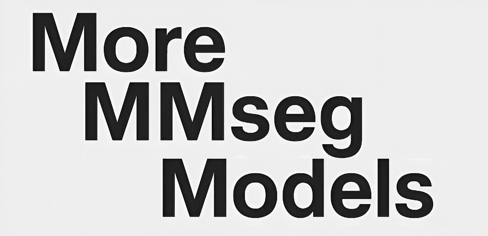

# More MMSeg Models

  

## Introduction
This project is dedicated to implementing / adapting more models for use with the [MMSegmentation](https://github.com/open-mmlab/mmsegmentation/) framework.

## Model Zoo

  <b>Overview</b>

<table align="center">
  <tbody>
    <tr align="center" valign="center">
      <td><b>Supported Backbones</b></td>
      <td><b>Supported Heads</b></td>
    </tr>
    <tr valign="top">
      <td>
        <ul>
          <li><a href="models/backbones/efficientvit.py">EfficientViT</a></li>
          <li><a href="models/backbones/stripnet.py">StripNet</a></li>
        </ul>
      </td>
      <td>
        <ul>
          <li><a href="models/decode_heads/efficientvit_head.py">EfficientViT Head</a></li>
        </ul>
      </td>
    </tr>
  </tbody>
</table>